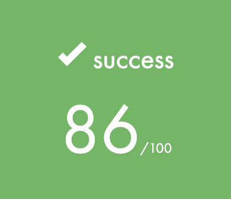
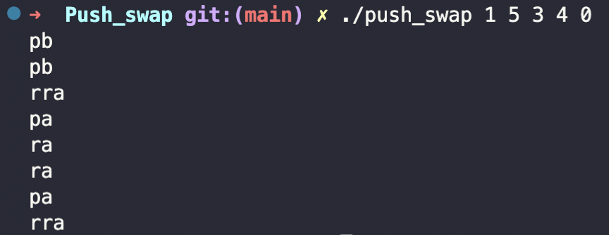

# Push_swap - Because Swap_push isn’t as natural

<!-- Gif here -->

## Description

> <em> This project will make you sort data on a stack, with a limited set of instructions, using the lowest possible number of actions. To succeed you’ll have to manipulate various types of algorithms and choose the one (of many) most appropriate solution for an optimized data sorting. </em>

## How to use

We start by compiling our two programs `checker` and `push_swap`. Simply run:\
`make`

### push_swap

1. `push_swap` program takes integers as an argument.\
With given arguments `push_swap` program returns all operations what it used to sort the stack to ascending order.\
Here is an example how to run program correctly.\
`./push_swap <random set of integers>`\
`./push_swap 1 5 3 4 0`

Arguments has to be:

- Integers
- Seperated with spaces
- In digit format
- There cannot be dublicates

Otherwise you get an `Error` message

### checker

1. `checker` takes integers as an argument as well.\
`./checker <set of integers>`

2. After running `checker` program with set of integers, terminal will wait instructions.

<video width="320" height="240" controls>
  <source src="./README/video/checker.mov" type="video/mp4">
Your browser does not support the video tag.
</video>

<video width="320" height="240" controls>
  <source src="./README/video/checker_gif.mov" type="video/mp4">
Your browser does not support the video tag.
</video>

3. After when you are done with your instructions end the instruction phase with `CTRL + D` key combination.

4. If the stack is sorted with all instructions what was given, program outputs `OK` if not output is `KO`.

All valid instructions

- `sa` - Swap first 2 elements at the top of stack a
- `sb` - Swap first 2 elements at the top of stack b
- `ss` - `sa` and `sb` at the same time
- `pa` - Take first element from stack b and put that to top of stack a
- `pb` - Take first element from stack a and put that to top of stack b
- `ra` - Shift up all elements of stack a by 1
- `rb` - Shift up all elements of stack b by 1
- `rr` - `ra` and `rb` at the same time
- `rra` - Shift down all elements of stack a by 1
- `rrb` - Shift down all elements of stack b by 1
- `rrr` - `rra` and `rrb` at the same time

### push_swap and checker together

1. We can redirect the outpuf of `push_swap` program to `checker` program. This allows us to see if `push_swap` program sorted the stack correctly.\
`ARG="1 5 3 4 0"; ./push_swap $ARG | ./checker $ARG`

## PDF

<a href="./README/push_swap.en.pdf">Push_swap PDF</a>

### Keywords

- Sorting
- Algorithms
- Stacks in Computer Science
- Optimization